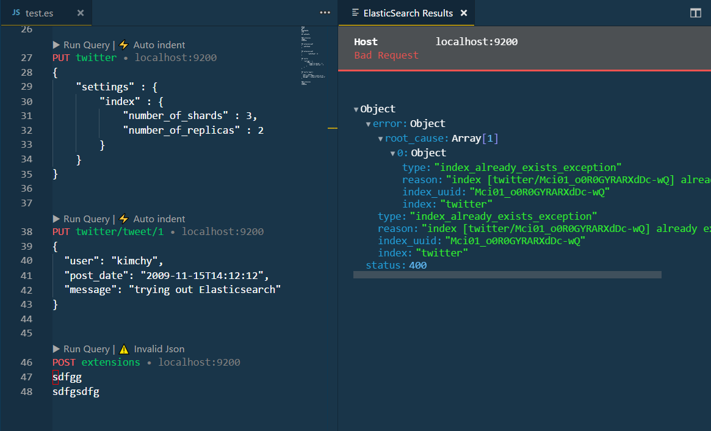

## Elasticsearch for VSCode

Welcome to Elasticsearch for Visual Studio Code! An extension for developing Elasticsearch queries like Kibana and Sense extention.



https://marketplace.visualstudio.com/items?itemName=ria.elastic

```
ext install elastic
```

## Using

- First, install Visual Studio Code then install **Elastic** extension by pressing `F1` or `ctrl+shift+p` to open command palette, select Install Extension and type `elastic`.
- Open an existing file with a `.es` file extenion or open a new text file (`ctrl+n`) and change the language mode to `Elasticsearch (es)` by pressing `ctrl+k,m` and select `es`. Elasticsearch queries and funtionalities are enabled in the es language mode in Visual Studio Code editor.
- Create a new connection profile using command palette by pressing `F1`, type sqlman to run `Elastic: Set Host` command. See manage connection profile for more information about how to create and edit connection profiles in your User Settings (`settings.json`>`elastic.host`) file.
- Write Elasticsearch query script in the editor using IntelliSense and Snippets.
- Execute elastic queries by pressing button labeld: `Run Query` command. You can also use a shortcut (`ctrl+shift+e`). See customize shortcuts to learn about change shortcut key bindings to es queries.
- View the elastic queries execution results and messages in result view.

## Commands

The extension provides several commands in the Command Palette for working with .es files:

- **Elastic: Run Query** script, for Elasticsearch in the editor.
- **Elastic: Set Host** to create connection profile and connect.

## Roadmap

- Work with multi host
- User Authentication
- IntelliSense like kibana autocomplete

## Change Log

### [0.6]
- fixed issue [#1](https://github.com/hsen-dev/vscode-elastic/issues/1): elasticsearch logo style guides
- adding [feature requested](https://github.com/hsen-dev/vscode-elastic/issues/3): `elastic.showResultAsDocument`: Show result in a new json file, or show in default view.
- some bug fixes

### [0.5]
- big changes: migrate execution of query to CodeLens.
- add Json validator and `Auto indent` command.

### [0.4]
- bug fixes
- add context menu for `copy JSON path` and `copy JSON content`

### [0.3]
- bug fixes
- better output ui
- add `_cat` toolbar
- work with `Elasticsearch` file type without `.es` extention


### [0.2]
- bug fixes
- better output ui

### [0.1]
- initial release
