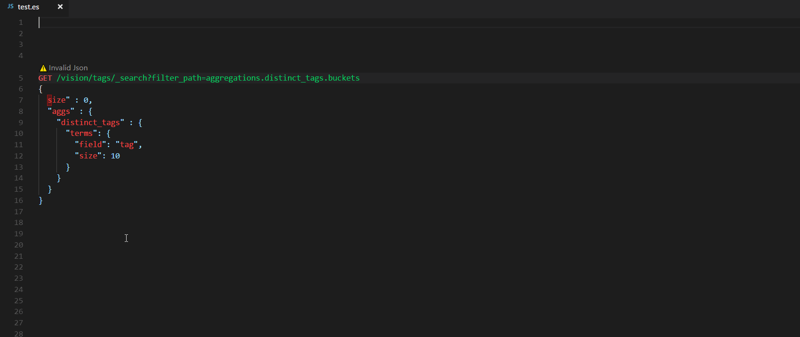

## Elasticsearch for VSCode

Welcome to Elasticsearch for VSCode! An extension for developing elasticsearch queries like Kibana console and Sense extention.



## Using

- Open an existing file with a `.es` file extenion or open a new text file (`ctrl+n`) and change the language mode to `Elasticsearch (es)` by pressing `ctrl+k,m` and select `es`. Elasticsearch queries and funtionalities are enabled in the es language mode in Visual Studio Code editor.
- For https endpoints, just add protocol type in url : ```https://host```
- For auth protected clusters, you can use ```user:pass@http://host:9200``` as the endpoint url to have it auth.


## Commands

- **Elastic: Set Host** to create connection profile and connect.

## Keymaps

- **Alt + Enter** / **Ctrl + Enter** to execute selected query.

## Roadmap

- Work with multi host
- User Authentication
- IntelliSense like kibana autocomplete
