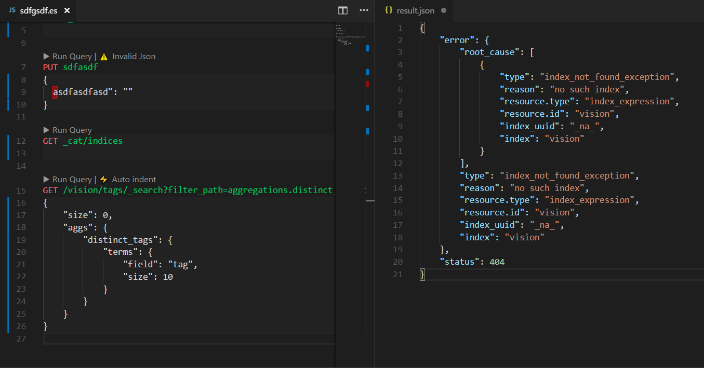

## Elasticsearch for VSCode

Welcome to Elasticsearch for VSCode! An extension for developing elasticsearch queries like Kibana console and Sense extention.

https://marketplace.visualstudio.com/items?itemName=ria.elastic

## Using

- Open an existing file with a `.es` file extenion or open a new text file (`ctrl+n`) and change the language mode to `Elasticsearch (es)` by pressing `ctrl+k,m` and select `es`. Elasticsearch queries and funtionalities are enabled in the es language mode in Visual Studio Code editor.

## Commands

- **Elastic: Set Host** to create connection profile and connect.

## Roadmap

- Work with multi host
- User Authentication
- IntelliSense like kibana autocomplete
